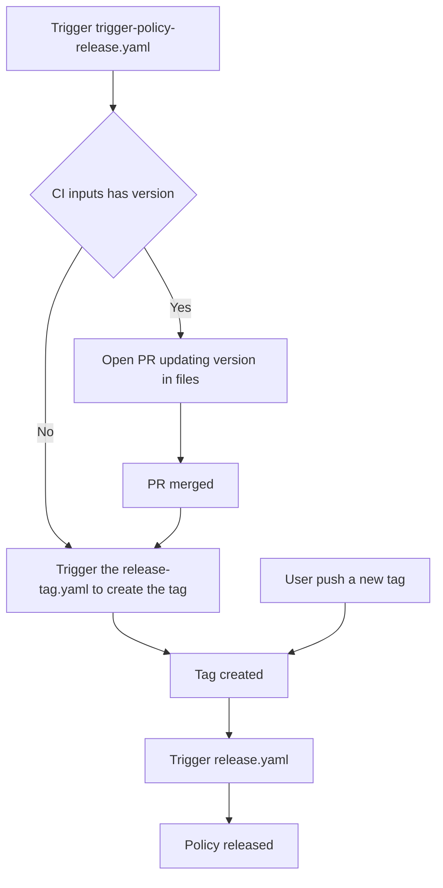

# Contributing to Kubewarden Policies

Thank you for your interest in contributing! This document outlines the
technical workflow for developing, testing, and releasing policies within this
repository.

Kubewarden is language-agnostic. This repository contains policies written in
Rust, Go and Rego.

# Directory Structure

This repository is a monorepo. While each policy is functionally independent,
they share common tooling and dependencies.

```text
.
├── policies/ # Policy source code
│ ├── Cargo.toml # Rust Workspace configuration
│ ├── Cargo.lock # Shared dependency lock file for Rust
│ ├── <policy-name>/ # Specific policy directory
│ │ ├── src/ # Source code
│ │ ├── test_data/ # Files for testing
│ │ ├── Makefile # Standardized build commands
│ │ ├── metadata.yml# Artifact Hub metadata
│ │ ├── <any other policy file>
│ ├── <policy-name>/ # Specific policy directory
│ │ ├── <any other policy file>
```

# Rust Workspace

To optimize build times and ensure consistency, all Rust policies are members
of a single Rust Workspace. The `policies/Cargo.toml` defines the workspace
members. Common dependencies are shared across policies to reduce maintenance
overhead. When adding a new Rust policy, ensure it is added to the members list
in the root Cargo.toml.

# How to Build Policies

We use `make` to provide a consistent interface across different programming
languages.

Navigate to the policy directory:

```console
cd policies/policy-name
```

Build the Wasm binary:

```console
    make policy.wasm
```

# How to Test Policies

All policies in this repository should provide unit test and integration tests.
To run all the tests run the following command:

```console
make test e2e-tests
```

# How to Release a Policy

The release process is fully automated via CI/CD to ensure consistency and
provenance. This repository has CI that automate the task of bumping policy
version in all places required. This is done by the
`.github/workflows/trigger-policy-release.yml`. When this CI is run users can
define the next version to be released like this:

```console
gh workflow run trigger-policy-release.yaml \
    -f "policy-working-dir=allowed-proc-mount-types-psp-policy" \
    -f "policy-version=1.0.6" \
    -R kubewarden/policies
```

> [!IMPORTANT]
> The `policy-working-dir` must be the name of the directory under the
> `policies` directory

In this scenario, the CI will open a PR bumping the version in all required
files. Once this PR is merged another CI will detect the release, create the
tag and continue the release process.

However, if you already bump the version, you can omit the `policy-version`
field:

```
gh workflow run trigger-policy-release.yaml \
    -f "policy-working-dir=allowed-proc-mount-types-psp-policy" \
    -R kubewarden/policies
```

Therefore, the CI will skip the PR to update the files and go strait to tagging
the release the policy artifacts.

> [!NOTE]
> The `trigger-policy-release.yaml` CI can also be trigged in the Github UI.

The release CI flow is something like this:



# Tag Pattern

The CI creates tags using the following logic based on the subdirectory under
the `policies` directory modified:

```
<policy-subdirectory-name>/v<semantic-version>`
```

Example: If you update the `pod-privileged-policy` policy to version `0.1.5`,
the CI will generate the tag: `pod-privileged-policy/v0.1.5`
