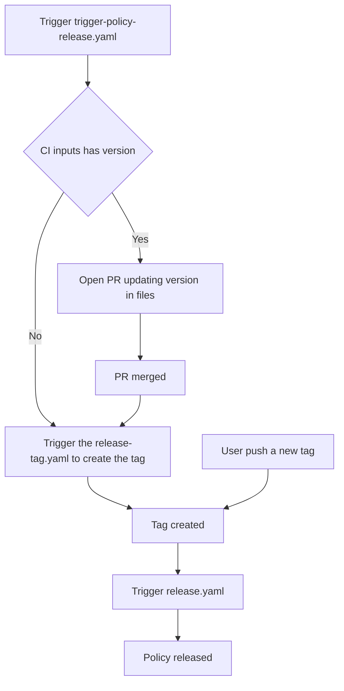

# Contributing to Kubewarden Policies

Thank you for your interest in contributing! This document outlines the
technical workflow for developing, testing, and releasing policies within this
repository.

Kubewarden is language-agnostic. This repository contains policies written in
Rust, Go and Rego.

# Directory Structure

This repository is a monorepo. While each policy is functionally independent,
they share common tooling and dependencies.

```text
.
├── policies/ # Policy source code
│ ├── Cargo.toml # Rust Workspace configuration
│ ├── Cargo.lock # Shared dependency lock file for Rust
│ ├── <policy-name>/ # Specific policy directory
│ │ ├── src/ # Source code
│ │ ├── test_data/ # Files for testing
│ │ ├── Makefile # Standardized build commands
│ │ ├── metadata.yml# Artifact Hub metadata
│ │ ├── <any other policy file>
│ ├── <policy-name>/ # Specific policy directory
│ │ ├── <any other policy file>
```

# Rust Workspace

To optimize build times and ensure consistency, all Rust policies are members
of a single Rust Workspace. The `policies/Cargo.toml` defines the workspace
members. Common dependencies are shared across policies to reduce maintenance
overhead. When adding a new Rust policy, ensure it is added to the members list
in the root Cargo.toml.

# How to Build Policies

We use `make` to provide a consistent interface across different programming
languages.

Navigate to the policy directory:

```console
cd policies/policy-name
```

Build the Wasm binary:

```console
    make policy.wasm
```

# How to Test Policies

All policies in this repository should provide unit test and integration tests.
To run all the tests run the following command:

```console
make test e2e-tests
```

## Language-Scoped Makefile Targets

The root `Makefile` provides targets that operate across all policies
regardless of language (`test`, `lint`, `e2e-tests`). For faster iteration,
language-scoped variants are also available.

| Target           | Scope                                                                             |
| ---------------- | --------------------------------------------------------------------------------- |
| `test-rust`      | Rust policies (detected by `Cargo.toml`) + shared crates under `policies/crates/` |
| `test-go`        | Go policies (detected by `go.mod`)                                                |
| `lint-rust`      | Rust policies + shared crates under `policies/crates/`                            |
| `lint-go`        | Go policies                                                                       |
| `e2e-tests-rust` | Rust policies                                                                     |
| `e2e-tests-go`   | Go policies                                                                       |

The language detection is file-based: a policy directory is considered Rust if
it contains a `Cargo.toml`, and Go if it contains a `go.mod`. These sets are
mutually exclusive. The shared crates under `policies/crates/` are all Rust and
are included in the `*-rust` targets for `test` and `lint` (consistent with the
full-repo targets), but not for `e2e-tests` since crates have no end-to-end
tests.

# How to Release a Policy

The release process is fully automated via CI/CD to ensure consistency and
provenance. This repository has CI that automate the task of bumping policy
version in all places required. This is done by the
`.github/workflows/trigger-policy-release.yml`. When this CI is run users can
define the next version to be released like this:

```console
gh workflow run trigger-policy-release.yaml \
    -f "policy-working-dir=allowed-proc-mount-types-psp-policy" \
    -f "policy-version=1.0.6" \
    -R kubewarden/policies
```

> [!IMPORTANT]
> The `policy-working-dir` must be the name of the directory under the
> `policies` directory

In this scenario, the CI will open a PR bumping the version in all required
files. Once this PR is merged another CI will detect the release, create the
tag and continue the release process.

However, if you already bump the version, you can omit the `policy-version`
field:

```
gh workflow run trigger-policy-release.yaml \
    -f "policy-working-dir=allowed-proc-mount-types-psp-policy" \
    -R kubewarden/policies
```

Therefore, the CI will skip the PR to update the files and go strait to tagging
the release the policy artifacts.

> [!NOTE]
> The `trigger-policy-release.yaml` CI can also be trigged in the Github UI.

The release CI flow is something like this:


```mermaid
flowchart TD

A[Trigger trigger-policy-release.yaml ] --> B{CI inputs has version}

B -->|Yes| C[Open PR updating version in files]
B -->|No| D[Trigger the release-tag.yaml to create the tag]
D --> E[Tag created]
E --> F[Trigger release.yaml]
C --> G[PR merged]
G --> D
F --> H[Policy released]
I[User push a new tag] --> E
```

# Tag Pattern

The CI creates tags using the following logic based on the subdirectory under
the `policies` directory modified:

```
<policy-subdirectory-name>/v<semantic-version>`
```

Example: If you update the `pod-privileged-policy` policy to version `0.1.5`,
the CI will generate the tag: `pod-privileged-policy/v0.1.5`

# Hauler Manifest

`hauler_manifest.yaml`, at the root of the repository, is a
[Hauler](https://github.com/hauler-dev/hauler) content manifest listing every
published policy image (`ghcr.io/kubewarden/policies/<policy-id>:<version>`),
so downstream consumers can vendor/air-gap all Kubewarden policies with a
single `hauler` invocation.

The manifest is reconciled weekly by
`.github/workflows/update-hauler-manifest.yaml`, which runs the
[`hauler/manifest`](https://github.com/updatecli/policies/tree/main/updatecli/policies/hauler/manifest)
Updatecli policy (via `updatecli compose apply --file
./updatecli/update-hauler-manifest.yaml`). Each policy's version is read
directly from the OCI registry (not from `metadata.yml`), so the manifest
always reflects what is actually published, even if a release PR bumping
`metadata.yml` has not merged yet. If a change is detected, a PR is opened
against `main`.

## Keeping the Manifest in Sync

CI enforces that every policy is correctly represented in the Hauler
manifest tooling. Each policy's `make check-hauler-manifest` target (run by
`reusable-ci.yaml`, and therefore also by the release workflow) verifies:

- a policy **not** listed in `policies/excluded-from-publishing.txt` is
  present in both `hauler_manifest.yaml` and
  `updatecli/values/hauler-manifest.yaml`
- a policy listed there is present in **neither** file

The check only verifies presence, never versions: the weekly Updatecli
automation is the source of truth for versions, and it will drift from
`metadata.yml` on purpose whenever a version bump hasn't been published to
the OCI registry yet (see `hack/check-hauler-manifest.sh`). A release fails
if this check fails, so a brand-new policy must be added to the manifest
tooling, or to the exclusion list, before its first release:

- **To publish it**, add matching entries to
  `updatecli/values/hauler-manifest.yaml`:
  - a `versions.<policy-id>` entry (a `dockerimage` source pointed at
    `ghcr.io/kubewarden/policies/<policy-id>` with a `semver` version filter)
  - a corresponding item under `documents[0].items`, with `repository`,
    `versionFrom: <policy-id>`, and a `certificate-identity-regexp` field
    pinned to that policy's release workflow tag
    (`.../release.yml@refs/tags/<policy-directory-name>/{version}`)

  and a matching image entry in `hauler_manifest.yaml` itself, using the
  version you intend to release first (the weekly automation corrects it
  afterwards if needed).

- **To keep it out** (test-only or otherwise unpublished policies), add the
  policy's directory name to `policies/excluded-from-publishing.txt`
  instead. This is also the file `release.yml` reads to decide whether to
  skip publishing to ArtifactHub and the policy-catalog.

Run `make -C <policy-directory> check-hauler-manifest` locally to check a
single policy, or `make check-hauler-manifest` from the repository root to
check all of them. Run
`updatecli compose diff --file ./updatecli/update-hauler-manifest.yaml`
to preview what the scheduled workflow would change.
